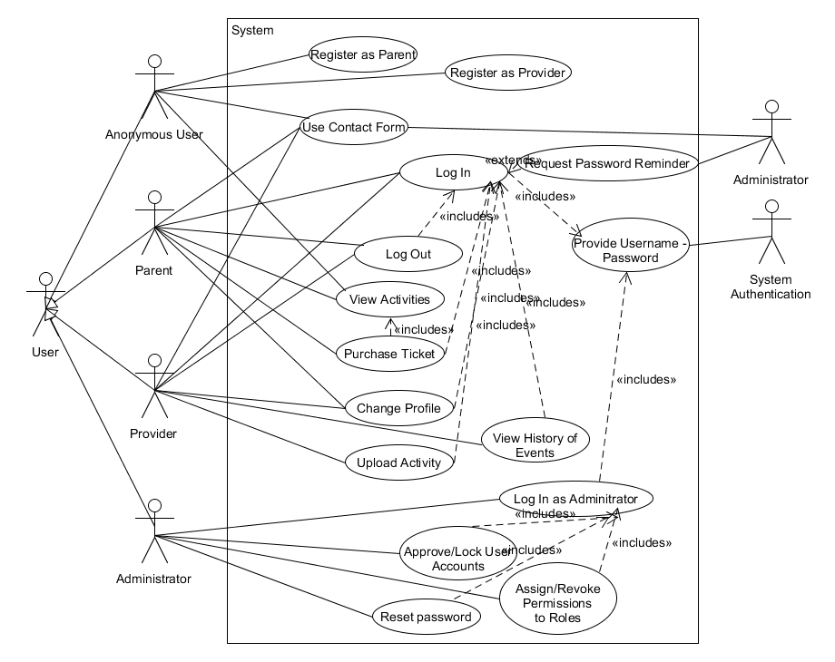
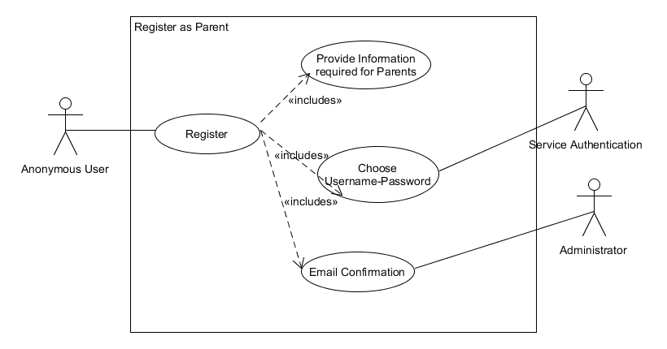
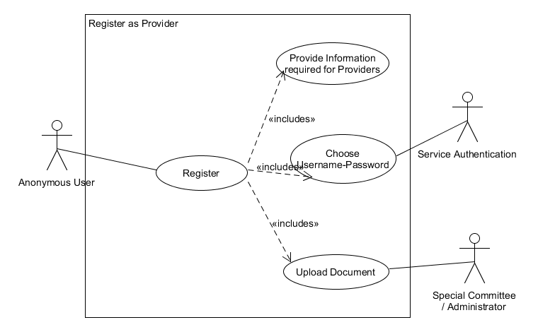
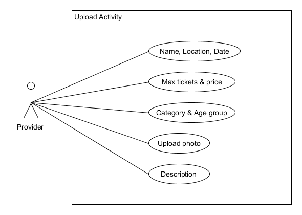
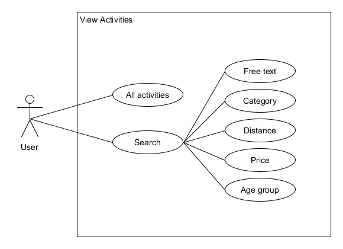

Software Requirements
=====================

Table of Contents
-----------------

* [Introduction](#introduction)
    * [Purpose of Document](#purpose-of-document)
    * [Intended Audience](#intended-audience)
* [Goal](#goal)
* [System Scope and Boundaries](#system-scope-and-boundaries)
* [User Categories and Characteristics](#user-categories-and-characteristics)
* [Profit](#profit)
    * [Ways of making profit](#ways-of-making-profit)
    * [Transition from zero to big company](#transition-from-zero-to-big-company)
* [Digital wallet](#digital-wallet)
* [Ticket policy](#ticket-policy)
    * [Digital ticket](#digital-ticket)
    * [Return policy](#return-policy)
    * [Max tickets restrictions](#max-tickets-restrictions)
* [Functional requirements](#functional-requirements)
    * [Registration](#registration)
    * [Authentication](#authentication)
    * [Authorization Levels](#authorization-levels)
    * [Copyright issues](#copyright-issues)
    * [Responsive design](#responsive-design)
* [Non-functional requirements](#non-functional-requirements)
    * [Reliability and Availability](#reliability-and-availability)
    * [Performance](#performance)
    * [Safety](#safety)
    * [Security](#security)
    * [Usability](#usability)
    * [Extensibility](#extensibility)
    * [Platform Versatility](#platform-versatility)

Introduction
------------

### Purpose of Document

The purpose of this document is to describe the requirements and functionalities of the platform. It also illustrates the purpose of the platform and explains the constraints and scope of the system. Any suggested changes to the requirements listed in this document should be included in the last version of it.

### Intended Audience

This document is intended primarily for the following audiences:
- **Software Engineers**: This document provides the framework for the understanding, design, and implementation of the platform.
- **Developers**: The platform shall meet the requirements listed in this document.
- **Testers**: Under test, the system shall satisfy the requirements.
- **Parents and Organizers**: This document can be used as a Platform Usage Guide.
- **Investors**: Investors will be able to gain a better understanding of the platform and the business policy.

Goal
----

The “Playground” constitutes a user-friendly web platform, that is addressed to parents with children, as well as to organizers of children’s activities. In particular, parents can browse through a wide variety of activities and can specify the output of their search attempt, by applying any number of the determined criteria available. For instance, an age restriction, constricts the results within the given age range and a type restraint leads to viewing activities that are associated with the selected type. The organizers of activities can provide the information of their services using the web platform. This information will act as the basis for the search results displayed to the user. 

The platform should be free to use, but parents who wish to book a seat online, should proceed to buy a ticket according to the payment methods.

System Scope and Boundaries
---------------------------

**The scope statement** defines what the project will and will not include, in enough detail to clearly communicate to all participants.

**The boundaries identify** where the system to be sized starts and ends.  The sizing should include everything for which the team is responsible:
- The system is accessible to all users/guests free of charge. The account registration is also free for every user who wants to enjoy the privilege of buying a ticket.  
- System’s interface supports only the Greek language. 
- There will be no real charge of credit cards or any bank account. The system will just virtually change some database’s values in order to display the exchange to the user.
- Internet access is required for usage of our system services. 
- The Android and IOS versions will not be available for better resources management (due to lack of time we decided to create and focus on a web app that will efficiently work, and let the other versions for future implementation) and budget constraints. However the web application will be responsive and adaptive to mobile devices via web browsers.
- User’s email is required in order to verify the registration.
- No software installation is required in order to use this application, except for web browsers (new versions recommended).
- System services are directed only for Athens’ residents , and aimed at children from 3 to 16 years of age.

User Categories and Characteristics
-----------------------------------

Platform users are not required to have specialized computer skills, but they need to have basic knowledge of computers and Internet browsing. Users need to feel comfortable with the Greek language.

There are four types of users that interact with the platform: anonymous users, parents, service providers (organizers), and platform administrators.  Each of these four types uses the system in a different way and therefore has non-identical requirements and access permissions.

-  **Anonymous User**  
  Anonymous is a user who visits the platform without logging in. Such users can only search for activities (with or without specifying predefined criteria) and check tickets availability. In brief, non-registered users will have read-only access to the platform. However, they will be able to use the contact form to inquire further information.

-  **Parent**  
  By the term parent, we mean the user who has already logged in the platform and is interested in finding activities for their child. The permissions of a Parent include the access permissions of an Anonymous User. However, a parent has some extra features, such as booking and buying a ticket, logging in and out of their account, modifying or deleting their account and communicating with the platform manager.

-  **Organizer (Service Providers)**  
  An organizer is considered to be the registered user who organizes an activity and wants to not only make it known to the public but also sell tickets through the platform. Service providers manage the information about their activities, such as the description, contact information, the amount they would like to receive from each ticket and the number of the available tickets. They are also authorized to communicate with the platform administrator.

-  **Administrator**  
  By the term administrator, we mean the user who has a special permission to manage and control the system. They need to have a better knowledge of the system than the rest of the users. As platform administrators, they have the right to manage the users and assign or revoke permissions to roles. Furthermore, they can reset and block a user's password in case of necessity. Another one of their major responsibilities is the communication with the Parents and Organizers.

Profit
------

**NOTE:** The following section presents a plan for the whole life cylcle of the application. At the current phase, we will ***not implement advertisments and paid promotional features.***

### Ways of making profit
- **5% of the paid amount**,for each payment, is reserved as service fee. So the stakeholder receives the 95% of the actual payment.
- **Advertisements** of 3rd party companies.
- **Paid promotional features** for stakeholders, displaying an activity at the home page or in the top of a relative search result. The special promotion has limited duration and it’s cost depend on the type of the promotion (home page - search engine) and the it’s duration.

### Transition from zero to big company
- **Early steps:** The registration of both the users and the stakeholders is free of charge, in order to achieve early attraction of users, smooth adoption of the stakeholders and concurrently being ahead of the competition. The only way of making money at this stage, will be only a 5% for each ticket purchase, just to cover a part of the cost of the development and the server or invest it in a marketing campaign.
- **Mid phase:** After achieving an adequate number of  available activities and active users, we can focus on selling advertising packages on 3rd party companies with products targeting parents and children. Prices will be in proportion with the traffic of the platform and the duration of the advertisement. At this point the company is supposed to be self-sufficient.
- **Scaling:** At this phase with a lot availble activities and stakeholders, competition between the stakeholders arises. It’s a great opportunity to leverage of it, providing paid promotional features for stakeholders while making extra profit. A stakeholder can pay to display one of his activities in the home page of the platform, or display it a top of the search result in each relative search (location, age, type). The prices will be in proportion with the duration of the promotion. There room for special promotions at the same time is predefined and limited to 6 activities at the home page and 3 activities on each type of search. Price table will be available soon.

### Digital wallet
--------
 A registered user can fill his digital wallet with credits only by using a debit/credit account. Transcation with a bank account will be supported. The correspondence between digital wallet credits and real money is 1 by 1 and no fee is applied during the transaction.

Digital wallet includes a reward policy for frequent users.
 - For every 10 tickets that a user has purchaced, 10 bonus point will be added to his wallet as a reward for consistently selecting our platform.
 - If the user makes deposit that exceed 100 euros, 7 bonus point are added to his digital wallet. Also, if he makes a deposit of 50-100 euros 3 points will be offered as a bonus.

Ticket policy
--------

### Digital ticket
A digital ticket is just a 10-digit ID number. Your kids are eligible to participate to an activity by providing the reservation name (probably your name) and the ticket ID. The digital ticket ID or IDs are displayed right after a succesfull payment and also sent to a given email.

### Return policy:
Cancellation of a reservation is not supported by the platform and refund/return cannot be provided in any form.
Purchasing a ticket is strictly an one-way procedure.

### Max tickets restrictions
Registered users are restricted to buy at most 10 tickets at once.
Group reservations (more than 10 tickets), are not supported by the paying platform directly, and you should sent a special request via the platform.

Functional requirements
-----------------------

### Registration

#### Anonymous User

No registration is required to use the platform as an anonymous user,
_i.e_ search for events. However, it is essential in order to purchase
tickets.

#### Parent

Registering as a parent requires the following identification
information:

- Full Name
- Date of Birth
- Email address
- Home address
- Telephone number

To complete the registration, an email confirmation will be required.

#### Provider

Registering as a provider requires the following information:

- Brand Name
- Email address
- Telephone number
- Address
- Tax registration number
- Bank account number
- Upload a document containing details on the provided services /
  activities

For a successful registration, the relevant document will have to be
approved by a special committee. Afterwards, an email will be sent to
the user confirming the successful registration.

#### Administrator

Registering is not applicable for this user.

### Authentication

For registered users, the authentication process requires a username
and a password, which are specified by the user during registration.
In case the user forgets her password, she can request a reset via
an email that will be sent to the address specified during
registration.

### Authorization Levels

#### Anonymous User
The anonymous user is limited to browsing the platform. Thus, she is
not able to purchase tickets. However, she is able to use the contact
form to inquire further information about the platform.

#### Parent
The parent can search activities based on a range of criteria such as:

- category
- distance / location
- age group
- price

In addition to these, _free text_ search will be available. The
results of the search query will be displayed on a map.

The parent can buy available tickets for selected activities using an
electronic payment method _e.g._ credit / debit card. After a
successful purchase, the tickets will be emailed to her in PDF format.

She can modify / update information relevant to her account or cancel
her membership to the platform by deleting her account.

Finally, she can request for help via a special contact form.

#### Provider

The provider can upload activities / services to the platform. Each
one of them should include:

- Name
- Location / venue
- Detailed description
- Photo
- Date & time
- Maximum number of tickets
- Age group
- Category
- Ticket price

In addition he can view a history of his events, as well as monthly
reports with the total revenue and total tickets sold per event.

He can modify the details of his account and he can cancel his membership
by deleting his account. In this case, all activities that he provides
become _inactive_.

Finally, he can request for help via an appropriate contact form.

#### Locked user account

For parents, it means that they can no longer log in to the platform.
For providers, it means that all their activities become inactive and
they can no longer log in to the platform.

#### Administrator

The administrator is able to manage user accounts. Thus, she is able
to:

- approve / lock user accounts
- approve password reset requests from users

### Copyright issues

#### Photos

A watermark will be automatically added to every photo that is
uploaded to the platform in order to prevent its use in any other
context. This functionality will be implemented by an external module
to the system.

### Responsive design

Responsive design will be used in every aspect of the website so that
all web pages render well on a variety of devices and window or screen
sizes.

Non-functional requirements
---------------------------

### Reliability and Availability

In order to be considered reliable, the platform needs to meet the following requirements:
- The software must not fail to the detriment of the user.
- The platform should be available for use all the time.
- The platform should be connected to an online map service.
- Errors should hardly ever occur.
- In case of failure, the system shall not accidentally lose information related to the users, the transactions, and the activities. Moreover, the recovery time should be minimal.

### Performance

The software shall meet the following performance requirements:
- The platform shall respond promptly to the actions of the user and manage the data quickly.
- The data retrieval time should be short.
- The platform should not decrease the computer performance.

### Safety

It is essential that the software meets all of the following safety requirements:
- The software should not affect data in other databases.    
- It should under no circumstances cause damage to the computer. 

### Security

It is crucial that the software satisfies all of the following security requirements:
- In order to take specific actions, users need to log in to their account. The platform shall not allow authorized access if the user fails to provide correct log in information. The user will be notified of any login failure.
- If a user (initially Anonymous) wishes to register on the platform and the desired username is occupied, they should be asked to choose a different username.
- Username - password combinations shall never be intercepted. Thus, the messages between the system and the database should be encrypted during log-in communications.
- For security reasons and to be consistent with international standards, passwords must satisfy the following criteria:
  1.    Passwords may consist of any combination of ASCII characters.
  2.    Passwords shall consist of at least 6 and at most 15 characters.
  3.    Passwords shall be case sensitive.
- Passwords shall never be viewable at the point of entry or at any other time.
- Passwords stored in the database must be encrypted. As a result, unauthorized users will be prevented from obtaining the passwords.
- The system should keep the database secure.
- In order to support the HTTPS protocol on all pages, the platform shall use self-signed certificates.
- Parents and Organizers will not be able to change information not related to them. 
- The platform supports different user categories with different access permissions. These permissions may only be changed by the administrator.
- A watermark will be used in the photos that accompany the activities.

### Usability

As far as usability is concerned, the platform shall meet the following requirements:
- The platform interface will be user-friendly, easy to use and consistent with similar platforms.
- Users with relevant experience should get familiar with the platform operations without difficulty.
- Users without prior experience should be able to understand the platform's functionality quite quickly.

### Extensibility

The platform should be easily extended. Therefore, the code should be written in a way that favors the implementation of new features and functions.

### Platform Versatility

The platform shall be versatile in switching between desktop, tablet and mobile interface. It should also be fully functional in all the aforementioned kind of devices. 

Software Tools
--------------------------------

Architecture
---------------------------

UML
----------

### Use Cases

The use case diagrams for the main system actions, as well as for several individual subactions are following below.

#### Overall System

_There are four types of users, namely Anonymous User, Parent, Provider and Administrator._

#### Registration as a Parent

#### Registration as a Provider

#### Upload Activity as Provider

#### View activities

_The user can either choose to view all the available activities, or perform a specialised search according to her criteria._

#### Purchase Ticket as Parent

_The procedure to purchase a ticket is as follows: the user selects the desired ticket, then she proceeds to the payment options providing any additional contact options if it is deemed necessary. After the payment is successful, she can access the email address that was provided during her registration into the platform in order to download the ticket in pdf format._

### Components

### Deployment

Wireframes
----

